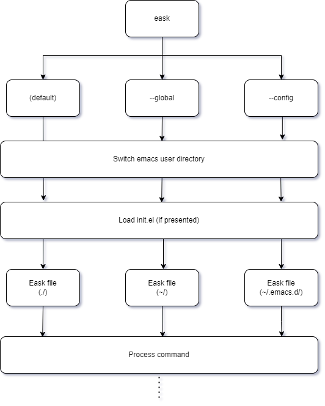

Qob’s CLI is fully featured but simple to use, even for those who have very
limited experience working from the command line.

The following is a description of the most common commands you will use while
developing your Common Lisp project. See the [Commands and options](https://cl-qob.github.io/Getting-Started/Commands-and-options/)
for a comprehensive view of Qob’s CLI.

Once you have installed [Qob](), make sure it is in your `PATH`. You can test
that Qob has been installed correctly via the help command:

```
$ qob --help
```


💡 Optionally, you can use `--show-hidden` to show all available commands and
options!


The output you see in your console should be similar to the following:

```
NAME:
  qob - CLI for building, running, testing, and managing your Common Lisp dependencies

USAGE:
  qob [global-options] [<command>] [command-options] [arguments ...]

OPTIONS:
      --help           display usage information and exit
      --no-color       enable/disable color output
      --version        display version and exit
  -a, --all            enable all flag
  -g, --global         change default workspace to ~/.qob/
  -v, --verbose <INT>  set verbosity from 0 to 5 [default: 3]

COMMANDS:
  build          Build the executable
  clean          Delete various files produced during building
  create         Create a new Common Lisp project
  dists          List out all installed dists
  eval           Evaluate lisp form with a proper PATH
  files          Print all system files
  package        Build a system artifact
  info           Display information about the current system(s)
  init           Initialize project to use Qob
  install        Install systems
  install-deps   Automatically install system dependencies
  install-dists  Install dists
  list           List the registered systems
  load           Load lisp files
  locate         Print out Qob installed location
  status         Display the state of the workspace
  uninstall      Uninstall systems

AUTHORS:
  Jen-Chieh Shen <jcs090218@gmail.com>

LICENSE:
  MIT
```

## 🗃️ The `qob` Command

The most common usage is probably to run eask with your current directory being
the input directory. Then you run eask followed by a subcommand:

```sh
$ Qob info             # Print out Eask-file information
```

Notice the subcommand can be nested:

```sh
$ Qob clean workspace  # Deletes your `.Qob` folder
```

Pass in option `--help` to look up more information regarding the command you
are using:

```sh
$ qob clean --help
```

The output, and it shows there are 7 subcommands supported:

```
Delete various files produced during building

Usage: eask clean <type> [options..]

Commands:
  clean all                  Do all cleaning tasks                                                                                                                                          [aliases: everything]
  clean autoloads            Remove generated autoloads file
  clean dist [destination]   Delete dist subdirectory                                                                                                                                     [aliases: distribution]
  clean elc                  Remove byte compiled files generated by eask compile
  clean log-file             Remove all generated log files
  clean pkg-file             Remove generated pkg-file
  clean workspace            Clean up .eask directory                                                                                                                                            [aliases: .eask]

Positionals:
  <type>  type of the cleaning task

...
````

Here is a list of known nested subcommands:

- eask create
- eask clean
- eask generate
- eask generate workflow
- eask link
- eask lint
- eask run
- eask source
- eask test

## 📌 Knowing your `quicklisp` directory

Qob creates an isolated environment, so it won't create any side effects after
playing, testing, and running your elisp packages. But it's important to know
what elpa directory (you can think of this as your `.emacs.d`) the current Eask
session is pointing to, so you can release the full potential of this tool!

Here is how Eask works behind the scene in different scenarios:

| Name   | Description                                                          | Options            | Path         |
|--------|----------------------------------------------------------------------|--------------------|--------------|
| local  | The default behavior, use Eask as package dev tool                   | n/a                | `./.eask`    |
| config | Use Eask as your package manager (It can be used as a test tool too) | `-c` or `--config` | `~/.emacs.d` |
| global | Use Eask as a general tool, it's unrelated to other scopes           | `-g` or `--global` | `~/.eask`    |

You might think of why these rules are created.

It's easy to understand **config** and **local** scopes since many other build
tools use the **local** scope to create an isolated environment. The **config**
scope is an additional feature for people who prefer managing their packages
with an external tool and not by built-in `package.el` or config base
`straight.el`, so you can save up startup time to check if packages are
installed for your Emacs to operate.

So what is the **global** scope in terms of Eask? Why it's needed?

Eask is more than a build tool now. Several commands don't require their
dependencies as package dependencies. For example, the `cat` command:

```sh
$ eask cat [PATTERNS..]
```

`cat` is a simple command that mimics Linux's default `cat` command, but it does
the syntax highlighting for you! How it's implemented? The command relies on
an external package [e2ansi][], and this is neither the `package` nor `config`
dependency (it could be, but let's assume we don't want it).

How do we use this command without side effects to your project or personal
emacs configuration? The global scope is introduced for this problem. Now we
can add any useful commands without worrying your environment got messed
up.

Here is the flowchart describes Eask's lifecycle:

<p align="center">

</p>

By default, Eask uses your current directory as your workspace since most of
the time you would just want to operate jobs for your elisp packages.


<!-- Links -->

[e2ansi]: https://github.com/Lindydancer/e2ansi
